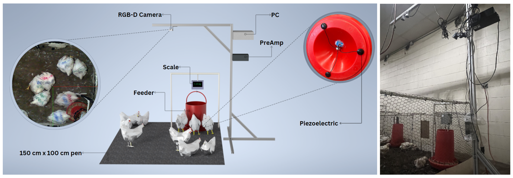
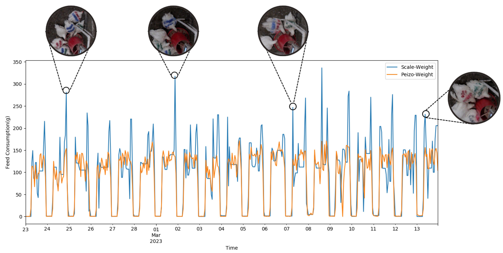

# ChickenSense: A Low-Cost Deep Learning-Based Solution for Poultry Feed Consumption Monitoring Using Sound Technology



## Abstract

"This research proposes a low-cost system consisting of a hardware setup and a deep learning-based model to estimate broiler chickens’ feed intake, utilizing audio signals captured by piezoelectric sensors. The signals were recorded 24/7 for 19 consecutive days. A subset of the raw data was chosen, and events were labeled in two classes, feed-pecking and non-pecking (including singing, anomaly, and silence samples). Next, the labeled data were preprocessed through a noise removal algorithm and a band-pass filter. Then, the spectrogram and the signal envelope were extracted from each signal and fed as inputs to a VGG-16-based convolutional neural network (CNN) with two branches for 1D and 2D feature extraction followed by a binary classification head to classify feed-pecking and non-pecking events. The model achieved 92% accuracy in feed-pecking vs. non-pecking events classification with an f1-score of 91%. Finally, the entire raw dataset was processed utilizing the developed model, and the resulting feed intake estimation was compared with the ground truth data from scale measures. The estimated feed consumption showed an 8 ± 7% mean percent error on daily feed intake estimation with a 71% R2 score and 85% Pearson product moment correlation coefficient (PPMCC) on hourly intake estimation. The results demonstrate that the proposed system estimates broiler feed intake at each feeder and has the potential to be implemented in commercial farms."




## Citation

If you use this work, please cite:

```
 @article{amirivojdan2024chickensense,
    title={ChickenSense: A Low-Cost Deep Learning-Based Solution for Poultry Feed Consumption Monitoring Using Sound Technology},
    author={Amirivojdan, Ahmad and Nasiri, Amin and Zhou, Shengyu and Zhao, Yang and Gan, Hao},
    journal={AgriEngineering},
    volume={6},
    number={3},
    pages={2115--2129},
    year={2024},
    publisher={MDPI}
}
```
